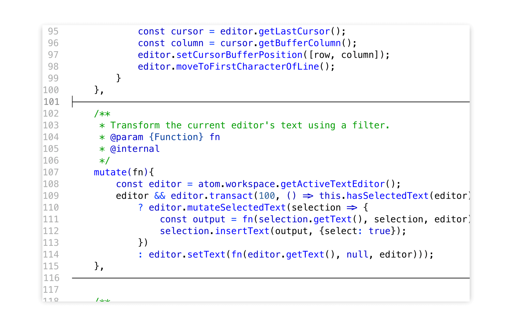

Form-feed support for Atom
==========================

[![Build status: TravisCI][TravisCI-badge]][TravisCI-link]
[![Build status: AppVeyor][AppVeyor-badge]][AppVeyor-link]

Display form-feed characters (`U+000C`) as horizontal dividers in source code.

Inspired by the [MELPA package](https://github.com/wasamasa/form-feed) of the same name.

Features:
---------
* Render form-feeds as horizontal dividers or as `^L` (using [caret notation][])
* Snippets for inserting form-feeds: `\f`, `^L`
* Editor commands (without default keybindings)
	*	`form-feeds:go-to-prev-feed`
	*	`form-feeds:go-to-next-feed`
	*	`form-feeds:strip-feeds`

Customisation
-------------
You can tweak the rendering of form-feed indicators using your stylesheet:

~~~less
@import "packages/form-feeds/styles/variables.less";

// Thicker border
@{ff-border} @{ff-selector}::before{
	border-top-width: 2px;
}

// Replace `^L` with a green `FF` when `placeholderStyle` is set to "caret"
@{ff-caret} @{ff-selector}::before{
	content: "FF";
	color: #0f0;
}
~~~

More info
---------
* [Caret notation][]
* [Form-feed characters](https://en.wikipedia.org/wiki/Page_break#Form_feed)
* [_“What are carriage return, linefeed, and form feed?”_](https://stackoverflow.com/a/3098328)

[Caret notation]: https://en.wikipedia.org/wiki/Caret_notation
[TravisCI-badge]: https://travis-ci.org/Alhadis/Atom-FormFeeds.svg?branch=master
[TravisCI-link]:  https://travis-ci.org/Alhadis/Atom-FormFeeds
[AppVeyor-badge]: https://ci.appveyor.com/api/projects/status/82ue5mapkwsj6x7l?svg=true
[AppVeyor-link]:  https://ci.appveyor.com/project/Alhadis/atom-formfeeds
